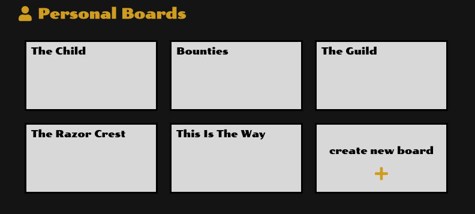
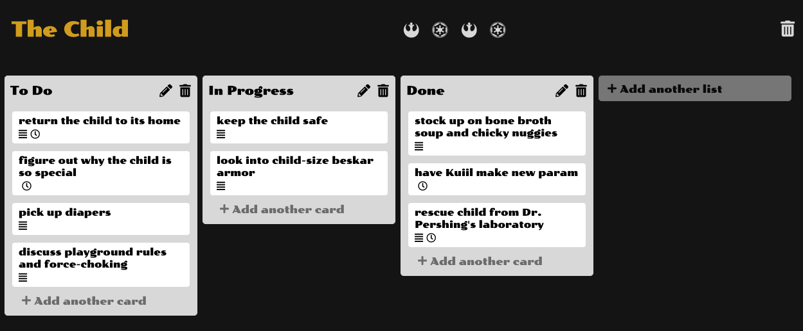
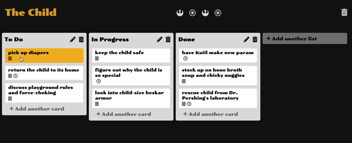

# R2DToDo

[Live Demo](https://r2dtodo.herokuapp.com/)

## Description

R2DToDo, (a Trello clone), is a workflow management application that allows users to create and share boards that track the progress of action/todo items.

## Technologies Used

* Backend: Ruby on Rails / PostgreSQL

* Frontend: React / Redux

* Hosting: Heroku

* Other libraries:
    * [react-beautiful-dnd](https://github.com/atlassian/react-beautiful-dnd)

## Features

**Boards, Lists, Cards**

A user can have mulitple boards that they create, or that are shared with them.



 These Boards house lists and cards, which can be used to organize project workflows, todos, etc.

 

 **Drag-and-Drop**

Users can drag and drop cards between lists.

 

 This required a custom route:

 ```ruby
 patch 'cards/update_cards/:id', :to => 'cards#update_cards'
 ```
As well as backend logic to make sure the new card order was saved in the database:

```ruby
def update_cards
        @card_og = Card.find(params[:id])
        list_drag = @card_og.list
        list_drop = card_params[:list_id].to_i
        og_order = @card_og.order
        @cards_drag = Card.where(list_id: @card_og.list_id).order(:order)
        @cards_drop = Card.where(list_id: card_params[:list_id]).order(:order)
        
        if list_drag.id != list_drop  
            @cards_drop.reverse.each do |card|
                if card.order >= card_params[:order].to_i
                    new_order = card.order + 1
                    card.update(order: new_order)
                end
            end
            
            @card_og.update_attributes(card_params)
            
            @cards_drag.each do |card|
                if card.order > og_order
                    new_order = card.order - 1
                    card.update(order: new_order)
                end
            end

        else

            @card_og.update(order: -1)

            if og_order > card_params[:order].to_i #moved card up in list
                
                @cards_drag.reverse.each do |card|
                    if card.order >= card_params[:order].to_i && card != @card_og && card.order < og_order
                        new_order = card.order + 1
                        card.update(order: new_order)
                    end

                end
            else
                
                @cards_drag.each do |card|
                    if card.order <= card_params[:order].to_i && card != @card_og && card.order > og_order #moved card down in list
                        new_order = card.order - 1
                        card.update(order: new_order)
                    end
                    
                end

            end
            
            @card_og.update(order: card_params[:order].to_i)
        
        end


        @board = list_drag.board

        render "api/boards/show"

    end
```

 ## Future Updates

 * Drag and Drop Lists
    * Allow lists to be drag-and-dropped

* Sharing
    * Users can share boards with other R2DToDo users

* Comments
    * Members of a board can leave comments on cards for other board members